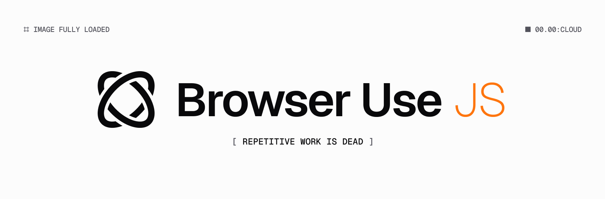

```sh
pnpm add browser-use-sdk
```

## Two-Step QuickStart

1. ☝️ Get your API Key at [Browser Use Cloud](https://cloud.browser-use.com)...

1. ✌️ Automate the web!

```ts
import BrowserUse from 'browser-use-sdk';

const client = new BrowserUse({
  apiKey: 'bu_...',
});

const result = await client.tasks.run({
  task: 'Search for the top 10 Hacker News posts and return the title and url.',
});

console.log(result.doneOutput);
```

> The full API of this library can be found in [api.md](api.md).

### Structured Output with Zod

```ts
import z from 'zod';

const TaskOutput = z.object({
  posts: z.array(
    z.object({
      title: z.string(),
      url: z.string(),
    }),
  ),
});

const result = await client.tasks.run({
  task: 'Search for the top 10 Hacker News posts and return the title and url.',
});

for (const post of result.parsedOutput.posts) {
  console.log(`${post.title} - ${post.url}`);
}
```

### Streaming Agent Updates

```ts
const task = await browseruse.tasks.create({
  task: 'Search for the top 10 Hacker News posts and return the title and url.',
  schema: TaskOutput,
});

const stream = browseruse.tasks.stream({
  taskId: task.id,
  schema: TaskOutput,
});

for await (const msg of stream) {
  switch (msg.status) {
    case 'started':
    case 'paused':
    case 'stopped':
      console.log(`running: ${msg}`);
      break;

    case 'finished':
      console.log(`done:`);

      for (const post of msg.parsedOutput.posts) {
        console.log(`${post.title} - ${post.url}`);
      }
      break;
  }
}
```

## Webhook Verification

> We encourage you to use the SDK functions that verify and parse webhook events.

```ts
import {
  verifyWebhookEventSignature,
  type WebhookAgentTaskStatusUpdatePayload,
} from 'browser-use-sdk/lib/webhooks';

export async function POST(req: Request) {
  const signature = req.headers['x-browser-use-signature'] as string;
  const timestamp = req.headers['x-browser-use-timestamp'] as string;

  const event = await verifyWebhookEventSignature(
    {
      body,
      signature,
      timestamp,
    },
    {
      secret: SECRET_KEY,
    },
  );

  if (!event.ok) {
    return;
  }

  switch (event.event.type) {
    case 'agent.task.status_update':
      break;
    case 'test':
      break;
    default:
      break;
  }
}
```

## Advanced Usage

## Handling errors

When the library is unable to connect to the API,
or if the API returns a non-success status code (i.e., 4xx or 5xx response),
a subclass of `APIError` will be thrown:

<!-- prettier-ignore -->
```ts
const task = await client.tasks
  .create({ task: 'Search for the top 10 Hacker News posts and return the title and url.' })
  .catch(async (err) => {
    if (err instanceof BrowserUse.APIError) {
      console.log(err.status); // 400
      console.log(err.name); // BadRequestError
      console.log(err.headers); // {server: 'nginx', ...}
    } else {
      throw err;
    }
  });
```

Error codes are as follows:

| Status Code | Error Type                 |
| ----------- | -------------------------- |
| 400         | `BadRequestError`          |
| 401         | `AuthenticationError`      |
| 403         | `PermissionDeniedError`    |
| 404         | `NotFoundError`            |
| 422         | `UnprocessableEntityError` |
| 429         | `RateLimitError`           |
| >=500       | `InternalServerError`      |
| N/A         | `APIConnectionError`       |

### Retries

Certain errors will be automatically retried 2 times by default, with a short exponential backoff.
Connection errors (for example, due to a network connectivity problem), 408 Request Timeout, 409 Conflict,
429 Rate Limit, and >=500 Internal errors will all be retried by default.

You can use the `maxRetries` option to configure or disable this:

<!-- prettier-ignore -->
```js
// Configure the default for all requests:
const client = new BrowserUse({
  maxRetries: 0, // default is 2
});

// Or, configure per-request:
await client.tasks.create({ task: 'Search for the top 10 Hacker News posts and return the title and url.' }, {
  maxRetries: 5,
});
```

### Timeouts

Requests time out after 1 minute by default. You can configure this with a `timeout` option:

<!-- prettier-ignore -->
```ts
// Configure the default for all requests:
const client = new BrowserUse({
  timeout: 20 * 1000, // 20 seconds (default is 1 minute)
});

// Override per-request:
await client.tasks.create({ task: 'Search for the top 10 Hacker News posts and return the title and url.' }, {
  timeout: 5 * 1000,
});
```

On timeout, an `APIConnectionTimeoutError` is thrown.

Note that requests which time out will be [retried twice by default](#retries).

### Accessing raw Response data (e.g., headers)

The "raw" `Response` returned by `fetch()` can be accessed through the `.asResponse()` method on the `APIPromise` type that all methods return.
This method returns as soon as the headers for a successful response are received and does not consume the response body, so you are free to write custom parsing or streaming logic.

You can also use the `.withResponse()` method to get the raw `Response` along with the parsed data.
Unlike `.asResponse()` this method consumes the body, returning once it is parsed.

<!-- prettier-ignore -->
```ts
const client = new BrowserUse();

const response = await client.tasks
  .create({ task: 'Search for the top 10 Hacker News posts and return the title and url.' })
  .asResponse();
console.log(response.headers.get('X-My-Header'));
console.log(response.statusText); // access the underlying Response object

const { data: task, response: raw } = await client.tasks
  .create({ task: 'Search for the top 10 Hacker News posts and return the title and url.' })
  .withResponse();
console.log(raw.headers.get('X-My-Header'));
console.log(task.id);
```

### Logging

> [!IMPORTANT]
> All log messages are intended for debugging only. The format and content of log messages
> may change between releases.

#### Log levels

The log level can be configured in two ways:

1. Via the `BROWSER_USE_LOG` environment variable
2. Using the `logLevel` client option (overrides the environment variable if set)

```ts
import BrowserUse from 'browser-use-sdk';

const client = new BrowserUse({
  logLevel: 'debug', // Show all log messages
});
```

Available log levels, from most to least verbose:

- `'debug'` - Show debug messages, info, warnings, and errors
- `'info'` - Show info messages, warnings, and errors
- `'warn'` - Show warnings and errors (default)
- `'error'` - Show only errors
- `'off'` - Disable all logging

At the `'debug'` level, all HTTP requests and responses are logged, including headers and bodies.
Some authentication-related headers are redacted, but sensitive data in request and response bodies
may still be visible.

#### Custom logger

By default, this library logs to `globalThis.console`. You can also provide a custom logger.
Most logging libraries are supported, including [pino](https://www.npmjs.com/package/pino), [winston](https://www.npmjs.com/package/winston), [bunyan](https://www.npmjs.com/package/bunyan), [consola](https://www.npmjs.com/package/consola), [signale](https://www.npmjs.com/package/signale), and [@std/log](https://jsr.io/@std/log). If your logger doesn't work, please open an issue.

When providing a custom logger, the `logLevel` option still controls which messages are emitted, messages
below the configured level will not be sent to your logger.

```ts
import BrowserUse from 'browser-use-sdk';
import pino from 'pino';

const logger = pino();

const client = new BrowserUse({
  logger: logger.child({ name: 'BrowserUse' }),
  logLevel: 'debug', // Send all messages to pino, allowing it to filter
});
```

### Customizing the fetch client

By default, this library expects a global `fetch` function is defined.

If you want to use a different `fetch` function, you can either polyfill the global:

```ts
import fetch from 'my-fetch';

globalThis.fetch = fetch;
```

Or pass it to the client:

```ts
import BrowserUse from 'browser-use-sdk';
import fetch from 'my-fetch';

const client = new BrowserUse({ fetch });
```

### Fetch options

If you want to set custom `fetch` options without overriding the `fetch` function, you can provide a `fetchOptions` object when instantiating the client or making a request. (Request-specific options override client options.)

```ts
import BrowserUse from 'browser-use-sdk';

const client = new BrowserUse({
  fetchOptions: {
    // `RequestInit` options
  },
});
```

#### Configuring proxies

To modify proxy behavior, you can provide custom `fetchOptions` that add runtime-specific proxy
options to requests:

 **Node** <sup>[[docs](https://github.com/nodejs/undici/blob/main/docs/docs/api/ProxyAgent.md#example---proxyagent-with-fetch)]</sup>

```ts
import BrowserUse from 'browser-use-sdk';
import * as undici from 'undici';

const proxyAgent = new undici.ProxyAgent('http://localhost:8888');
const client = new BrowserUse({
  fetchOptions: {
    dispatcher: proxyAgent,
  },
});
```

 **Bun** <sup>[[docs](https://bun.sh/guides/http/proxy)]</sup>

```ts
import BrowserUse from 'browser-use-sdk';

const client = new BrowserUse({
  fetchOptions: {
    proxy: 'http://localhost:8888',
  },
});
```

 **Deno** <sup>[[docs](https://docs.deno.com/api/deno/~/Deno.createHttpClient)]</sup>

```ts
import BrowserUse from 'npm:browser-use-sdk';

const httpClient = Deno.createHttpClient({ proxy: { url: 'http://localhost:8888' } });
const client = new BrowserUse({
  fetchOptions: {
    client: httpClient,
  },
});
```

## Frequently Asked Questions

## Requirements

TypeScript >= 4.9 is supported.

The following runtimes are supported:

- Web browsers (Up-to-date Chrome, Firefox, Safari, Edge, and more)
- Node.js 20 LTS or later ([non-EOL](https://endoflife.date/nodejs)) versions.
- Deno v1.28.0 or higher.
- Bun 1.0 or later.
- Cloudflare Workers.
- Vercel Edge Runtime.
- Jest 28 or greater with the `"node"` environment (`"jsdom"` is not supported at this time).
- Nitro v2.6 or greater.

Note that React Native is not supported at this time.

If you are interested in other runtime environments, please open or upvote an issue on GitHub.

## Contributing

See [the contributing documentation](./CONTRIBUTING.md).
